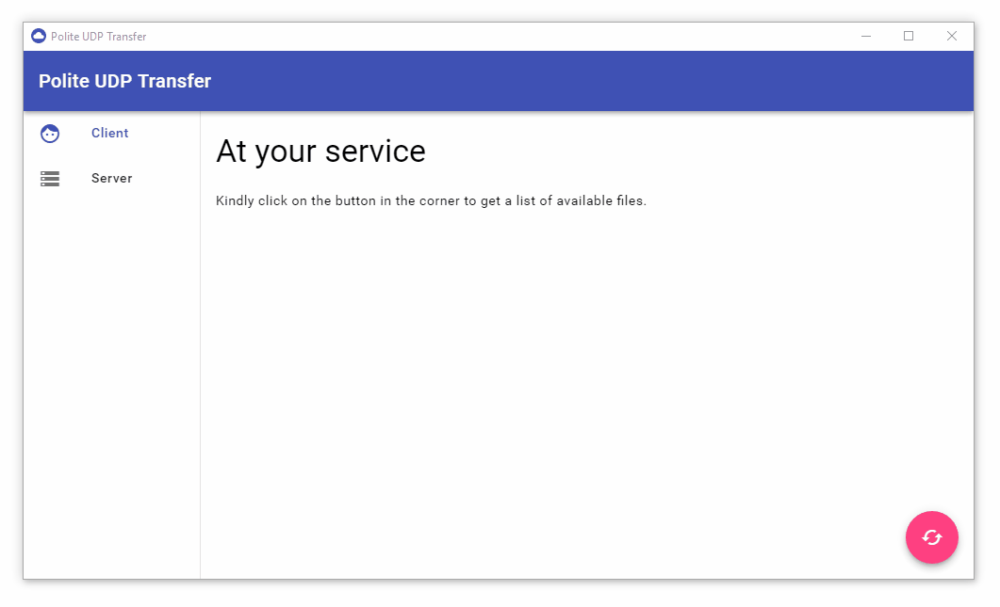

# "Polite" UDP File Sharing using Broadcast

Non-serious project to get my feet wet in UDP Datagrams and Electron. Not suitable for use in the real world. Can overload the network with binary UDP packets if large files are transferred.



## Features
* Can act as client and/or server in the one running app
* Share variable amount of files as server
* Fetch list of available files as client
* Ask for data broadcasting
* Broadcasting of file chunks
* Transfer progress
* Transferred file checksum verification
* Transferred file opening
* Packet loss simulation
* Lost packets resending
* Detailed configuration support

## Downloads
* [Windows x64](https://github.com/durasj/Polite-UDP-Transfer/releases/download/v0.1.1/PUDPT-0.1.1-win32.x64.zip)
* [Linux x64](https://github.com/durasj/Polite-UDP-Transfer/releases/download/v0.1.1/PUDPT-0.1.1-linux.x64.zip)

## Configuration

Configuration can be done using config.json:
* `./resources/app.asar.unpacked/config.json` in the packed format
* `./package.json` during development

| Name                        | Description        | Default |
| --------------------------- | ------------------ | ------- |
| ENABLE_SERVER               | Enable server part |  `true` |
| ENABLE_CLIENT               | Enable client part |  `true` |
| CHUNK_SIZE                  | Size of the file chunk sent over the network |  `1000` |
| SERVER_IP                   | Server IP adress   |  `"localhost"` |
| BROADCAST_ADDRESS           | IP address used for data broadcasting |  `"192.168.1.255"` |
| META_PORT                   | Port used for meta (plaintext) communication |  `10000` |
| DATA_PORT                   | Port used for data (binary) communication |  `10001` |
| POLITE_REQUEST_WORD         | Word used in the end of requests |  `"PLS"` |
| POLITE_ERROR_WORD           | Word used at the beginning of error messages |  `"SRY"` |
| MAX_FILES                   | Maximum number of files that can be picked via Server |  `5` |
| DOWNLOADS_FOLDER            | Folder used for downloads |  `"downloads"` |
| SIMULATE_PACKET_LOSS        | Simulate random packet loss |  `true` |
| PACKET_LOSS_PROBABILITY     | Probability that some packets will be lost<br>0.001 = 0.1% probability packets will be lost<br>1 = 100% probability packets will be lost<br>0.001 or less is recommended |  `0.001` |
| ENABLE_PACKET_LOSS_RECOVERY | Enable recovery of lost packets<br>Lost packets will be requested at the end of receiving |  `true` |
| ENABLE_DEBUG                | Enable debuging<br>Developer tools can be opened using Ctrl+Shift+I |  `false` |
| ENABLE_DEBUG_LOGGING        | Enable logging to console |  `true` |
| ENABLE_DEBUG_VERBOSE        | Enable verbose logging<br>WARNING: Can lead to great number of logged info if large files are used since a lot of repeating messages are logged and all received data objects are logged<br>Please use only on considerably small files which can fit within few packets |  `false` |

## Development

**Requirements**:
* Node.js v6 LTS + NPM
* Windows for win32 packaging

Clone this repository and install dependencies:

```
git clone https://github.com/durasj/Polite-UDP-Transfer.git
cd Polite-UDP-Transfer
npm install
```

After file changes, run `npm start`. The project should be built and the app opened.
For 64-bit win32 and linux folder packaging, run `npm package`
To create 64-bit win32 and linux installable, run `npm dist`

See [package.json](package.json) for more available commands

### Used

* [Electron](https://electron.atom.io/) ([Node](https://nodejs.org/) and [Chromium](https://www.chromium.org/))
* [Typescript](https://www.typescriptlang.org/)
* [Vue.js](https://vuejs.org/)
* [Material components](https://github.com/material-components/material-components-web)
* ... and others, see [package.json](package.json)

### Code structure

Directory `./src` contains raw source code. Directory `./build` compiled/copied source code ready to be used by Electron.

File `./main.js` is processed as first by Electron to bootstrap the application by creating the main window with `./build/index.html`, which loads some ui dependencies and `index.js`, `index.css`.

## Behind the scenes of the communication

Communicates politely on two ports:
* Meta port _default 10000_
* Data port _default 10001_

### Meta port
* Plaintext, UTF-8 encoding
* Server listens on predefined port _default 10000_
* Server responds to these commands:
  * `LIST` - Get JSON array of file info
  * `GET $fileId$` - Request file data broadcasting
  * `PARTS $fileId$ $binary list of UInt32 part indexes$` - Request missing specific file data parts broadcasting
* Server error responses:
  * `NOT IMPLEMENTED` - required command is not implemented
  * `UNKNOWN FILE` - sent file identifier doesn't match any file on the server

### Data port
* Binary data broadcasting
* Client listens on predefined port _default 10001_
* Server can broadcast file data messages to that port (if asked politely)
  * Message format: `$fileId$ $index of chunk$ $binary data chunk$`

### Politeness
* Only in meta communication
* Every request ends with predefined polite word _default PLS_, e.g. `LIST PLS`, with the exception of the PARTS command, which includes polite word before the binary list of the indexes
* Every response error starts with predefined polite word _default SRY_, e.g. `SRY NOT IMPLEMENTED`
