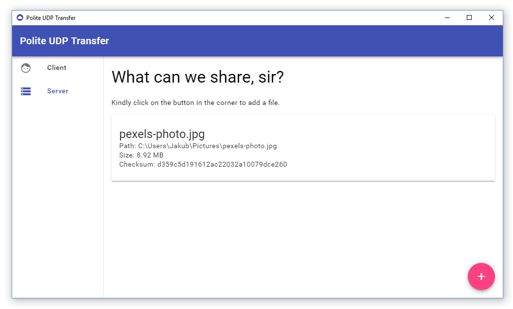

# "Polite" UDP File Sharing using Broadcast

Non-serious project to get my feet wet in UDP Datagrams and Electron

Communicates on two ports:
* Meta port _default 10000_
* Data port _default 10001_

## Meta port
* Plaintext, UTF-8 encoding
* Server listens on predefined port _default 10000_
* Server responds to these commands:
  * _LIST_ - JSON array of file info
* Server error responses:
  * _NOT IMPLEMENTED_ - required command is not implemented

## Data port
* Binary data broadcasting
* Client listens on predefined port _default 10001_
* Server can broadcast files to that port (if asked politely)

## Politeness
* Only in meta communication
* Every request ends with predefined polite word _default PLS_, e.g. "LIST PLS"
* Every response error starts with predefined polite word _default SRY_, e.g. "SRY NOT IMPLEMENTED"
